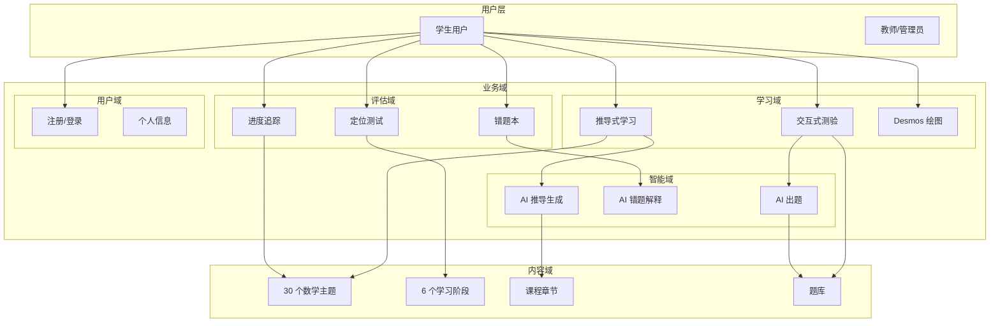
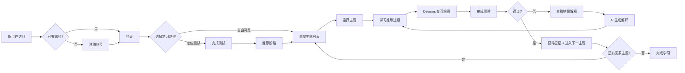
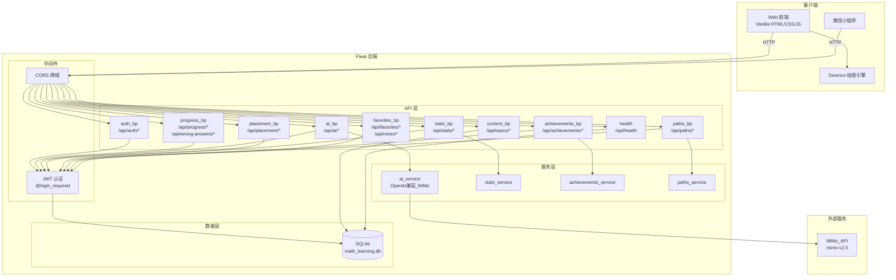
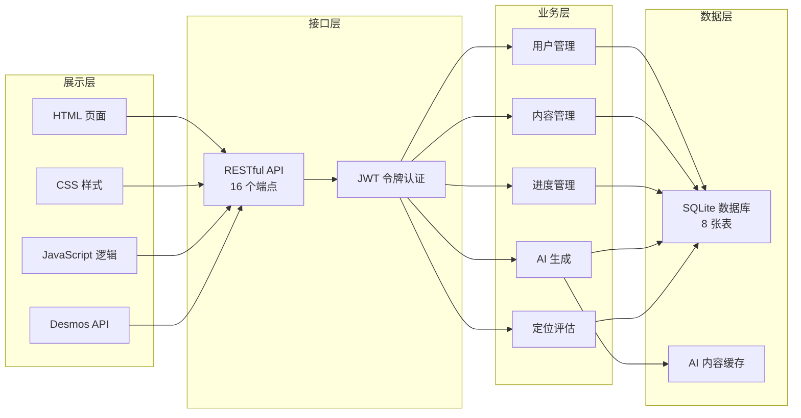
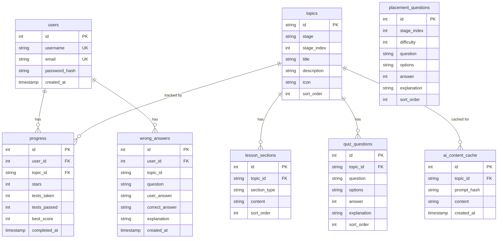
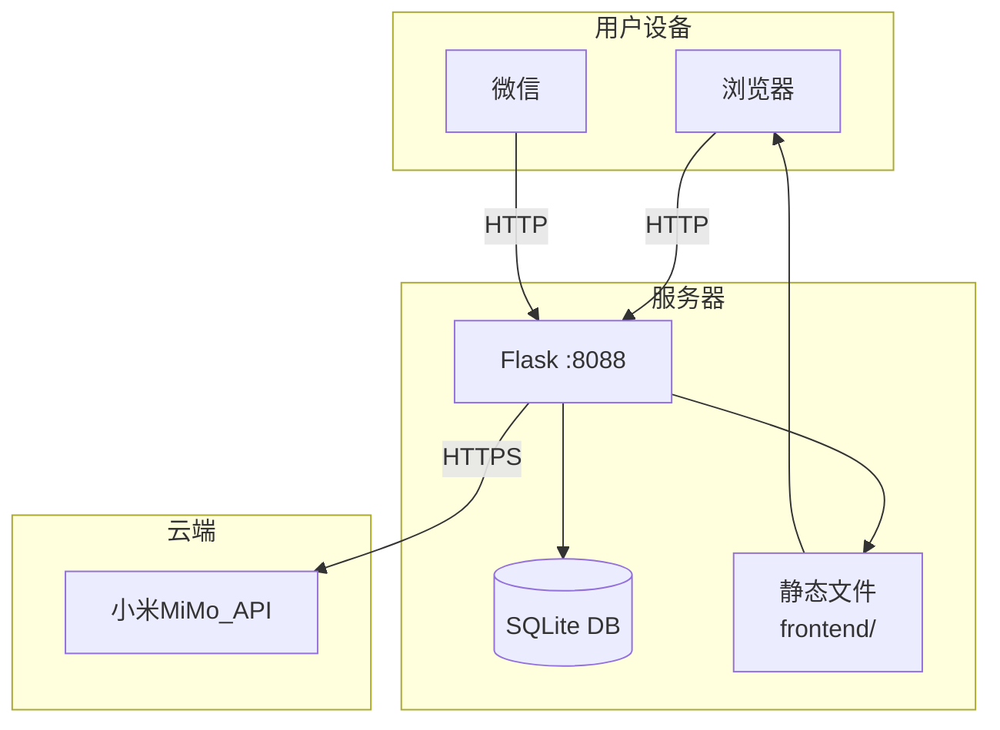

# 数学第一性原理学习系统 — 架构文档

## 一、业务架构图

### 业务流程

---

## 二、系统架构图

### 技术分层

---

## 三、数据模型

---

## 四、API 端点总览

| 模块 | 方法 | 路径 | 认证 | 说明 |
|------|------|------|------|------|
| 健康检查 | GET | `/api/health` | 否 | 服务状态 |
| 认证 | POST | `/api/auth/register` | 否 | 用户注册 |
| 认证 | POST | `/api/auth/login` | 否 | 用户登录 |
| 认证 | GET | `/api/auth/me` | 是 | 当前用户信息 |
| 内容 | GET | `/api/topics` | 否 | 主题列表 |
| 内容 | GET | `/api/topics/<id>` | 否 | 主题详情+课程+测验 |
| 进度 | GET | `/api/progress` | 是 | 学习进度列表 |
| 进度 | POST | `/api/progress` | 是 | 更新学习进度 |
| 错题 | GET | `/api/wrong-answers` | 是 | 错题列表 |
| 错题 | POST | `/api/wrong-answers` | 是 | 添加错题 |
| 错题 | DELETE | `/api/wrong-answers/<id>` | 是 | 删除错题 |
| AI | POST | `/api/ai/derive` | 是 | AI 推导生成 |
| AI | POST | `/api/ai/quiz` | 是 | AI 出题 |
| AI | POST | `/api/ai/explain` | 是 | AI 错题解释 |
| 定位 | GET | `/api/placement/questions` | 否 | 定位测试题 |
| 定位 | POST | `/api/placement/submit` | 是 | 提交定位测试 |
| 统计 | POST | `/api/stats/session/start` | 是 | 开始学习会话 |
| 统计 | POST | `/api/stats/session/end` | 是 | 结束学习会话 |
| 统计 | GET | `/api/stats/summary` | 是 | 学习统计摘要 |
| 统计 | GET | `/api/stats/daily` | 是 | 日统计 |
| 统计 | GET | `/api/stats/weekly` | 是 | 周统计 |
| 统计 | GET | `/api/stats/topic-mastery` | 是 | 主题掌握度 |
| 统计 | POST | `/api/stats/record-quiz` | 是 | 记录测验结果 |
| 成就 | GET | `/api/achievements` | 否 | 成就定义列表 |
| 成就 | GET | `/api/achievements/user` | 是 | 用户已获成就 |
| 成就 | POST | `/api/achievements/check` | 是 | 检查并解锁成就 |
| 成就 | GET | `/api/achievements/leaderboard` | 否 | 积分排行榜 |
| 积分 | GET | `/api/points` | 是 | 当前积分 |
| 积分 | GET | `/api/points/history` | 是 | 积分历史 |
| 积分 | GET | `/api/streak` | 是 | 连续学习天数 |
| 收藏 | GET | `/api/favorites` | 是 | 收藏列表 |
| 收藏 | POST | `/api/favorites` | 是 | 添加收藏 |
| 收藏 | DELETE | `/api/favorites/<topic_id>` | 是 | 取消收藏 |
| 收藏 | GET | `/api/favorites/check/<topic_id>` | 是 | 是否已收藏 |
| 笔记 | GET | `/api/notes` | 是 | 笔记列表 |
| 笔记 | POST | `/api/notes` | 是 | 新增笔记 |
| 笔记 | PUT | `/api/notes/<id>` | 是 | 更新笔记 |
| 笔记 | DELETE | `/api/notes/<id>` | 是 | 删除笔记 |
| 路径 | GET | `/api/paths/recommend` | 是 | 推荐学习路径 |
| 路径 | POST | `/api/paths/generate` | 是 | 生成个性化路径 |
| 路径 | GET | `/api/paths/current` | 是 | 当前学习路径 |
| 路径 | GET | `/api/paths/weak-areas` | 是 | 弱项分析 |

---

## 五、部署架构

